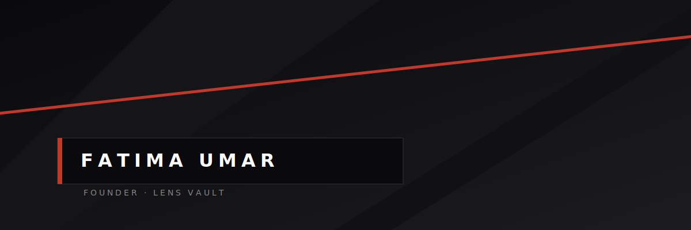

  

 

<table width="100%">
<tr>
<td width="60%" valign="top">

I am a Cybersecurity Analyst and the Founder of **Lens Vault**, specializing in digital protection, account hardening, and threat-prevention services. I architect and implement robust security solutions — from zero-knowledge encrypted password managers to enterprise-grade remote access configurations.

</td>
<td width="40%" valign="top">

`VULNERABILITY ASSESSMENT`
`PENETRATION TESTING`
`DDOS MITIGATION`
`INCIDENT RESPONSE`

</td>
</tr>
</table>

### ARSENAL

**Core capabilities** — Vulnerability Assessment · Penetration Testing (Burp Suite, Metasploitable) · DDoS Mitigation · VPN & Secure Remote Access (SSH) · Incident Response · Secure Coding Practices · UI/UX for Security Tools

### PROJECTS &amp; CASE STUDIES

<table width="100%">
<tr>
<td width="33%" valign="top">

**01 · Identity Protection**

[Lens Vault Password Manager](#)
Zero-knowledge, encrypted, multi-account password management tool. Exhibited at national technology and innovation events.

</td>
<td width="33%" valign="top">

**02 · Threat Mitigation**

[Network Defense & DDoS Mitigation Lab](#)
Simulated DDoS attacks and mitigation via rate limiting, firewall tuning, and deep packet inspection.

</td>
<td width="33%" valign="top">

**03 · Access Control**

[Secure Remote Access Implementation](#)
Enterprise-grade VPN, SSH, and host-based firewall rules for protected, high-security access.

</td>
</tr>
</table>

### EXPERIENCE

**Founder &amp; Cybersecurity Analyst** · [Lens Vault](#) &nbsp;·&nbsp; *2025 — Present*
Delivering digital protection, account hardening, and threat-prevention services. Directing product development, branding, and business strategy.

**Cybersecurity Intern** · [MRT Net Solutions](#) &nbsp;·&nbsp; *Jul 2024 — Sep 2024*
Conducted vulnerability assessments, endpoint troubleshooting, and system hardening tasks.

**Cybersecurity Intern** · [Natview Foundation for Technology Innovation](#) &nbsp;·&nbsp; *Jul 2023 — Sep 2023*
Supported senior engineers with incident follow-ups, technical reporting, and data analysis using ODK, Excel, and R.

<table width="100%">
<tr>
<td width="50%" valign="top">

### EDUCATION

B.Sc. Cyber Security — *Nile University of Nigeria* (2021–2025)
Graduate — *Collective Lab Incubation Program* (2025)

</td>
<td width="50%" valign="top">

### AVAILABLE FOR

Cybersecurity Consulting &amp; Vulnerability Assessments
Network Defense Audits &amp; System Hardening
Security Product Development

</td>
</tr>
</table>

**fatima.umarzy@gmail.com** &nbsp;·&nbsp; [LinkedIn](#) &nbsp;·&nbsp; [f.profile.tech](#)

